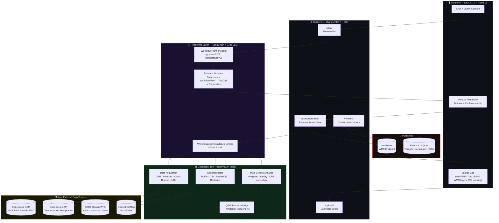
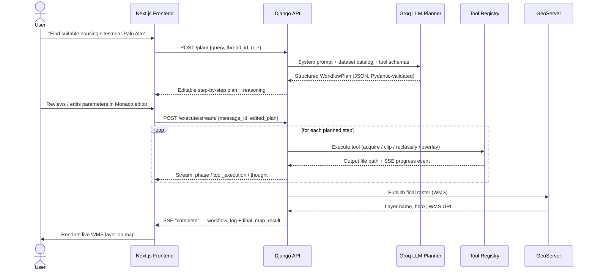
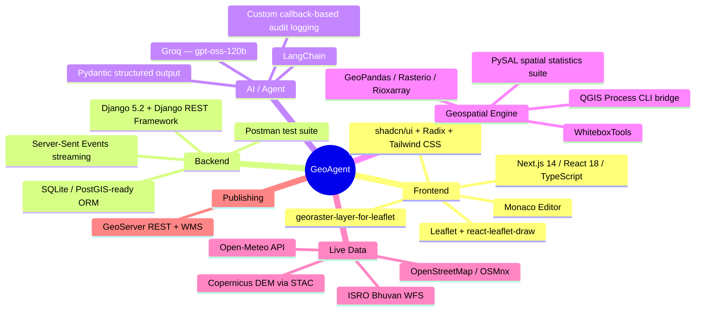
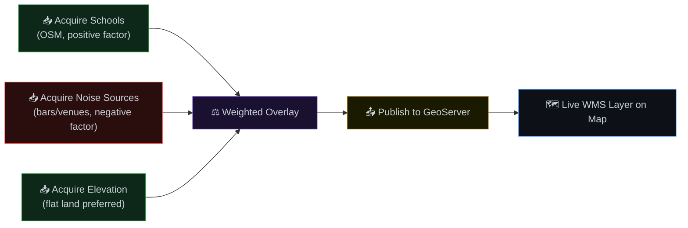

<div align="center">

# GeoSpatialAgent — Autonomous Geospatial Reasoning Platform

**An LLM-powered agent that plans, executes, and audits real-world GIS analysis — from a single sentence to a published web map.**

[](https://www.python.org/)
[](https://www.djangoproject.com/)
[](https://nextjs.org/)
[](https://www.langchain.com/)
[-F55036?logo=groq&logoColor=white)](https://groq.com/)
[](https://qgis.org/)
[](https://geoserver.org/)

*Turn "Find the best location for a new hospital in Guwahati, avoiding flood zones" into a fully executed, map-ready spatial analysis — with every reasoning step logged and every plan editable by a human before it runs.*

</div>

---

## Why This Project Exists

Traditional GIS work — buffering, overlay analysis, suitability mapping, damage assessment — requires a trained analyst to chain together dozens of tool calls in QGIS/ArcGIS by hand. **GeoAgent removes that bottleneck.**

It's an **agentic AI system** that understands a natural-language geospatial question, decomposes it into a structured, tool-by-tool execution plan, lets a human review/edit that plan, and then runs it against a real geoprocessing engine — producing a published, shareable web map at the end.

This isn't a chatbot wrapper. It's a **planner–executor architecture** with strict schema validation, live satellite/weather data acquisition, CRS-safe raster math, and full workflow auditability — the kind of system design expected in production ML/GIS engineering roles.

---

## The Experience

<table>
<tr>
<td width="50%" valign="top">

### 1. Ask
A user describes a goal in plain English on an interactive **Leaflet map** — optionally drawing a Region of Interest (ROI) by hand.

> *"Identify low-slope, low-flood-risk land near schools in Palo Alto for affordable housing."*

</td>
<td width="50%" valign="top">

### 2. Review
The agent returns a **structured, step-by-step JSON plan** — every tool call, parameter, and the *reasoning* behind it — rendered for human review and inline editing before anything executes.

</td>
</tr>
<tr>
<td width="50%" valign="top">

### 3. Execute
Approved steps run through a real **QGIS / WhiteboxTools geoprocessing engine**, streamed live to the UI via Server-Sent Events, with each tool's input/output logged.

</td>
<td width="50%" valign="top">

### 4. Publish
The final raster/vector output is **auto-published to GeoServer** as a WMS layer and rendered directly on the map — ready to share or embed.

</td>
</tr>
</table>

---

## System Architecture



---

## The Core Innovation: Plan → Review → Execute

Most "AI agents" execute tool calls immediately and hope for the best. GeoAgent instead **separates reasoning from execution**, giving humans a checkpoint over an LLM before it touches real geospatial data or compute — a design pattern directly relevant to safe, production-grade agentic systems.



---

## Geoprocessing Tool Registry

Every tool is `@register_tool` + `@validate_call` decorated with strict **Pydantic type validation**, so malformed LLM output fails fast instead of corrupting a pipeline.

| Category | Tool | What It Does |
|---|---|---|
| **Data Acquisition** | `acquire_elevation_data` | Streams real Copernicus DEM tiles via STAC + `stackstac`/`rioxarray` |
| | `acquire_generic_raster_data` | Live temperature/precipitation rasters from Open-Meteo |
| | `acquire_bhuvan_data` | ISRO Bhuvan WFS land-use/land-cover vector layers |
| | `acquire_vector_data` | OpenStreetMap features via OSMnx (schools, roads, POIs...) |
| | `acquire_data_from_url` | Generic fallback downloader for arbitrary datasets |
| | `get_data_from_ps4` | Loads curated local reference datasets by name |
| **Core Geoprocessing** | `perform_buffer` / `perform_buffer_analysis` | Zone-of-influence generation around vector features |
| | `clip_data` / `clip_data_to_roi` | Boundary intersection, including user-drawn ROIs |
| | `reclassify_raster` | Rule-based raster value remapping (e.g. suitability scoring) |
| | `select_and_rasterize_vector` | Converts a vector filter into an aligned binary raster |
| | `multiply_rasters` | Raster algebra for combining criteria |
| **Analysis** | `perform_mca` / `perform_weighted_overlay` | Multi-criteria suitability scoring with automatic CRS reprojection & 0–1 normalization |
| | `calculate_vector_area` | Quantifies impacted/affected area (e.g. flood damage assessment) |
| | `merge_vector_layers` | Combines multi-date hazard layers into one composite |
| **Publishing** | `publish_final_map` | Pushes results to GeoServer, returns WMS URL + bounding box |

> All 18+ tools are introspected at runtime (`inspect.signature`) to auto-generate the tool catalog fed to the LLM — **add a new tool, and the agent can use it with zero prompt changes.**

---

## Prompt Engineering Highlights

The planner isn't a generic "call functions" prompt — it encodes real domain expertise as **hard business rules** the LLM must follow, including:

- **Geographic Context Matching** — refuses to mix datasets from the wrong region
- **Temporal Hazard Selection Logic** — a 5-tier priority system (user upload → exact date → monthly aggregation → "latest" → ambiguous default) for choosing the correct flood/disaster layer
- **Two-Stage Suitability Analysis** — normalize every raster/vector criterion to a common 0–1 scale *before* combining, with automatic unit conversion (e.g. °C → K) when source data units differ from the user's request
- **Equal-Weight Fallback** — if the user gives no explicit weights, the agent defaults to equal weighting and *explicitly discloses that assumption* in its output
- **ROI-First Execution** — if a user has drawn a Region of Interest, it is injected into the prompt as an absolute constraint that reorders the entire plan

This is enforced end-to-end with a `PydanticOutputParser` against a typed `WorkflowPlan` schema, so the LLM's output is never "hopefully valid JSON" — it's validated or rejected.

---

## Tech Stack



| Layer | Technologies |
|---|---|
| **Frontend** | Next.js 14, React 18, TypeScript, Tailwind CSS, shadcn/ui, Leaflet, Monaco Editor, Recharts |
| **Backend API** | Django 5.2, Django REST Framework, Server-Sent Events, CORS-enabled |
| **AI Orchestration** | LangChain, Groq (`openai/gpt-oss-120b`), Pydantic v2 structured parsing |
| **Geospatial Core** | QGIS `qgis_process` CLI, WhiteboxTools, GeoPandas, Rasterio, Rioxarray, PySAL, Shapely, PyProj |
| **Data Sources** | Copernicus DEM (STAC), Open-Meteo, ISRO Bhuvan, OpenStreetMap |
| **Publishing / Storage** | GeoServer (WMS), Django ORM (Threads / Messages / ROIs / Uploaded Layers) |

---

## API Surface

```
POST   /agent_app/upload/                     Upload a user spatial data layer (vector/raster)
POST   /agent_app/plan/                       Generate a structured, editable analysis plan
POST   /agent_app/execute/                    Execute an approved plan (blocking)
POST   /agent_app/execute/stream/             Execute with live SSE progress streaming
GET    /agent_app/threads/                    List all analysis conversations
GET    /agent_app/threads/{id}/messages/      Full message + plan + execution history
GET    /agent_app/threads/{id}/layers/        Layers associated with a thread
GET    /agent_app/wms-proxy/                  Authenticated proxy to GeoServer WMS
```

A full **Postman collection + testing guide** ships with the backend for endpoint-level regression testing.

---

## Example Workflow: Housing Suitability Analysis



**Weights:** Schools `+0.3` · Noise `−0.4` · Flat terrain `+0.3` → single normalized suitability raster, published and rendered automatically.

---

## Getting Started

### Prerequisites
- Python 3.10+, Node.js 18+
- QGIS with `qgis_process` CLI available on `PATH`
- A [Groq API key](https://groq.com/) (free tier available)
- (Optional) A local GeoServer instance for map publishing

### Backend

```bash
cd gra_project/backend
pip install -r requirements.txt

# .env
echo "GROQ_API_KEY=your_key_here" > .env

python manage.py migrate
python manage.py runserver
```

### Frontend

```bash
cd gra_project/geospatial-analysis-platform
npm install   # or pnpm install
npm run dev
```

### Try It

```bash
curl -X POST http://localhost:8000/agent_app/plan/ \
  -H "Content-Type: application/json" \
  -d '{"query": "Find suitable areas for affordable housing in Palo Alto"}'
```

---

## Engineering Highlights (For Reviewers)

- **Human-in-the-loop AI safety** — LLM output is a *reviewable plan*, never blind tool execution
- **Schema-enforced LLM output** — Pydantic models eliminate the "hope the JSON parses" failure mode common in agent projects
- **Subprocess environment isolation** — a custom-cleaned `PATH`/env bridge lets a Python virtualenv safely shell out to system-level QGIS without dependency collisions
- **CRS-safe geoprocessing** — automatic reprojection and 0–1 normalization before any raster algebra, preventing silent spatial-accuracy bugs
- **Full auditability** — every tool call, input, output, and LLM "thought" is captured via a custom LangChain callback handler and persisted per conversation thread
- **Real-time UX** — Server-Sent Events stream agent reasoning and tool execution live to the frontend, not just a final answer
- **Extensible-by-design tool registry** — new geospatial capabilities are added with a single decorator and automatically surfaced to the LLM's prompt

---

## Project Structure

```
gra_project/
├── backend/
│   ├── agent_app/
│   │   ├── agent.py           # LangChain planner agent + prompt engineering
│   │   ├── tools.py           # 18+ registered geospatial tools
│   │   ├── views.py           # Django REST + SSE streaming endpoints
│   │   ├── callbacks.py       # Workflow audit-logging callback handler
│   │   ├── models.py          # Thread / Message / ROI / UserLayer schema
│   │   └── geoserver_utils.py # GeoServer publishing + WMS proxy
│   ├── postman/               # API regression test collection
│   └── requirements.txt
└── geospatial-analysis-platform/
    ├── app/                   # Next.js App Router pages
    ├── components/            # Map, ROI drawing, plan editor, shadcn/ui kit
    └── lib/api.ts             # Typed API client
```

---


<div align="center">

*Built as an exploration of safe, auditable, human-supervised AI agents for real-world spatial decision-making.*

</div>
